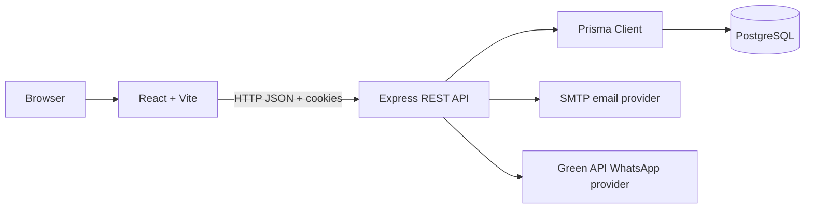

# Dhaka Tesla Pool

Share a seat. Split the fare. Survive Dhaka traffic.

Dhaka Tesla Pool is a ride-pooling MVP for the RoBenDevs Software Engineer Internship challenge. It models a small, explainable ride-sharing system around Jashim's three-seat battery-powered Tesla, Bullet. Nusrat travels from Banani to Mohakhali, Rafiq travels from Banani to Gulshan 1, and Shirin competes for the last available seat.

The project is intentionally a modular monolith: one React web app, one Express API, and one PostgreSQL database. There are no maps, microservices, queues, Redis, or real payment gateway in this MVP.

## Current Status

Implemented:

- React/Vite frontend with passenger, driver, authentication, profile, ride, fare, status, and history screens
- Express REST API with role-based authentication
- JWT sessions delivered through httpOnly cookies
- Email verification, password reset, email change, and WhatsApp phone OTP flows
- Prisma PostgreSQL schema, migration, and story-cast seed data
- Ride lifecycle and status history
- Pool capacity protection using an atomic conditional PostgreSQL update
- Integer paisa fare calculations
- Jest tests for fares, ownership, transitions, and seat capacity
- `main`, `pre-release`, and `release/v1.0.0` branches

Known gaps before a fully reproducible submission:

- Docker Compose has not been added yet.
- No public deployment URL or demo video has been added yet.
- The complete accept/cancel pool workflow needs a broader transaction around all related writes; the current atomic seat update protects the core seat claim but not every surrounding operation.
- The README documents the current implementation honestly rather than claiming deployment or Docker support that is not present.

## Product Scope

### Passenger

- Register and log in
- Verify email with a six-digit OTP
- Request a ride with pickup zone, destination zone, and seat count
- View a fare estimate before requesting
- Track `REQUESTED`, `MATCHED`, `DRIVER_ARRIVED`, `STARTED`, and `COMPLETED` states
- Cancel while the ride is still cancellable
- View ride history
- Update profile, change email, and verify a phone number through WhatsApp OTP

### Driver and Tesla

- Log in as a driver
- Toggle Bullet online or offline
- View matching ride requests
- Accept requests into a pool
- See passengers, fares, and occupied seats
- Mark arrival, start, and complete a pool
- View driver history

### Pooling

- Multiple ride requests can share one Tesla
- Bullet has a fixed capacity of three seats
- Pool membership is explicit through `RideRequest.poolId`
- Each ride request has an individual fare
- A status history row is created for each ride transition

## Story Cast and Demo Accounts

The seed script uses the required cast. These are local demo credentials only:

| Role | Name | Email | Password |
| --- | --- | --- | --- |
| Driver | Jashim | `jashim@tesla.pool` | `jashim123` |
| Passenger | Nusrat | `nusrat@tesla.pool` | `nusrat123` |
| Passenger | Rafiq | `rafiq@tesla.pool` | `rafiq123` |
| Passenger | Shirin | `shirin@tesla.pool` | `shirin123` |

Bullet is seeded with plate `DTP-001`, capacity `3`, and an initial `OFFLINE` status. Seed passwords are hashed before storage.

## Architecture



The browser never sends a JWT in an `Authorization` header. The API sets an httpOnly `dtp_token` cookie and the frontend uses credentialed requests. A short-lived, purpose-limited `dtp_verification` cookie is used only between registration and email verification.

### Database ERD

```mermaid
erDiagram
    USER ||--o| TESLA : owns
    USER ||--o{ RIDE_REQUEST : creates
    TESLA ||--o{ POOL : operates
    POOL ||--o{ RIDE_REQUEST : contains
    RIDE_REQUEST ||--o| FARE : has
    RIDE_REQUEST ||--o{ STATUS_HISTORY : records

    USER {
        string id PK
        string email UK
        string passwordHash
        enum role
        boolean emailVerified
        string phone UK
    }
    TESLA {
        string id PK
        string driverId FK_UK
        string name
        string plate UK
        int capacity
        enum status
    }
    POOL {
        string id PK
        string teslaId FK
        enum status
        int seatsOccupied
    }
    RIDE_REQUEST {
        string id PK
        string passengerId FK
        string poolId FK
        string pickupZone
        string dropoffZone
        int seatsRequested
        enum status
    }
    FARE {
        string id PK
        string rideRequestId FK_UK
        int baseFarePaisa
        int distanceChargePaisa
        int poolDiscountPaisa
        int totalFarePaisa
    }
    STATUS_HISTORY {
        string id PK
        string rideRequestId FK
        string fromStatus
        string toStatus
        datetime changedAt
    }
```

Reference diagrams supplied with the challenge are also kept here:

- [Architecture screenshot](Screenshot%202026-09-26%20012046.png)
- [ERD screenshot](Screenshot%202026-09-26%20011652.png)

## Matching Rule

Geography is deliberately represented by a predefined list of Dhaka zones with coordinates and corridor labels. No map provider is required.

A ride is poolable when:

1. Both rides have the same pickup zone.
2. Their destination zones belong to the same corridor.

Therefore Banani to Mohakhali and Banani to Gulshan 1 can share Bullet because both start in Banani and both destinations are in the north corridor. A ride from a different pickup zone or incompatible corridor is rejected from the current pool.

The matching rule lives in `dhaka-tesla-pool-server/src/utils/zones.js` and is kept conceptually identical to the frontend zone data.

## Fare Model

All monetary values are integer paisa. One taka is 100 paisa. Integers avoid binary floating-point rounding errors and make the fare auditable in the database.

```text
passengerFare = baseFare + distanceCharge - poolDiscount
```

Current constants:

```text
baseFare       = 3,000 paisa (BDT 30)
distanceCharge = distanceKm * 1,500 paisa
poolDiscount   = 20% of subtotal when at least two passengers share a pool
```

Hand-verifiable story examples:

| Route | Distance | Solo | Pooled |
| --- | ---: | ---: | ---: |
| Banani to Mohakhali | 3 km | 7,500 paisa | 6,000 paisa |
| Banani to Gulshan 1 | 2.5 km | 6,750 paisa | 5,400 paisa |

There is no real payment gateway. The MVP represents cash payment; a TeslaPay wallet can be added later without changing the fare calculation contract.

## Ride Lifecycle and Concurrency

```text
REQUESTED -> MATCHED -> DRIVER_ARRIVED -> STARTED -> COMPLETED
     \
      ----------------------> CANCELLED
```

Each transition is validated against an explicit state map and written to `StatusHistory`.

For the last-seat race, the pool service uses a PostgreSQL conditional update:

```sql
UPDATE "Pool"
SET "seatsOccupied" = "seatsOccupied" + requested_seats
WHERE id = pool_id
  AND "seatsOccupied" + requested_seats <= tesla_capacity
RETURNING *;
```

PostgreSQL serializes the row update. Exactly one competing request can claim a single remaining seat. At larger scale, the next step would be an idempotency key for accept operations, a transaction covering the complete accept workflow, and stronger database check constraints for all seat and money invariants.

## Technology Choices

| Area | Choice | Alternative | Why this choice fits | When to switch |
| --- | --- | --- | --- | --- |
| Frontend | React + Vite | Next.js | The brief allows plain React, Vite is fast locally, and the MVP is an authenticated app rather than an SEO-heavy site. | Use Next.js if SSR, server actions, or a unified deployment becomes valuable. |
| Routing | React Router | Next App Router | Explicit passenger/driver route guards are easy to understand and test. | Switch if the app adopts Next.js. |
| Backend | Express | NestJS or Fastify | Small REST surface, familiar middleware, and low ceremony for an internship MVP. | Consider Fastify for throughput or NestJS for a much larger team/module system. |
| API style | REST | GraphQL | Ride resources and lifecycle commands map naturally to HTTP verbs and are easy to inspect with curl. | Consider GraphQL if clients need many independently shaped read models. |
| Database | PostgreSQL | MySQL or SQLite | Transactions, row-level locking, relational constraints, and indexed status queries fit pooling better than a document store. | Add read replicas/geospatial extensions only when scale requires them. |
| ORM | Prisma | Knex or raw SQL | Typed relations and migrations make the User/Tesla/Pool/Ride model explainable. Raw SQL is used only for the critical conditional seat update. | Use more SQL for performance-critical reporting or complex locking paths. |
| Authentication | JWT in httpOnly cookies | Authorization headers or server sessions | Cookies keep tokens out of localStorage and satisfy the brief; JWT keeps the API stateless. | Add CSRF protection and a session/token revocation strategy for production. |
| Validation | Express middleware plus service validation | Zod or Joi | The current surface is small and validation remains close to the resource logic. | Adopt schema validation when API contracts are shared across more clients. |
| Styling | CSS | Tailwind or component library | Avoids an extra dependency and keeps the domain styling explicit. | Use a design system when multiple products share components. |
| Testing | Jest and Supertest | Vitest or Mocha | Jest covers backend behavior and Supertest is suitable for future HTTP contract tests. | Add contract and browser tests when deployment workflows stabilize. |
| OTP email | Nodemailer SMTP | SendGrid or SES | Works with the existing Gmail SMTP setup and keeps provider choice in environment variables. | Use a managed provider for production delivery, bounce handling, and observability. |
| OTP WhatsApp | Green API | Twilio | It matches the existing local verification sample and avoids rewriting the provider integration. | Switch to Twilio or Meta WhatsApp Cloud API for production support guarantees. |

## Project Structure

```text
.
├── README.md
├── dhaka-tesla-pool-web/
│   ├── src/
│   │   ├── api/             Axios API clients
│   │   ├── components/      Shared, passenger, and driver components
│   │   ├── context/         Authentication context
│   │   ├── hooks/           Auth and ride-status hooks
│   │   ├── pages/           Public, passenger, and driver pages
│   │   ├── routes/          Protected and role-based route guards
│   │   └── utils/           Fare, zones, and status helpers
│   └── vite.config.js
└── dhaka-tesla-pool-server/
    ├── prisma/
    │   ├── schema.prisma
    │   ├── migrations/
    │   └── seed.js
    ├── src/
    │   ├── controllers/
    │   ├── middlewares/
    │   ├── routes/
    │   ├── services/
    │   └── utils/
    └── tests/
```

## Prerequisites

- Node.js 20 or newer
- npm
- PostgreSQL 14 or newer
- A PostgreSQL database named `dhaka_tesla_pool`
- Optional SMTP account for email OTP delivery
- Optional Green API account for WhatsApp OTP delivery

## Environment Variables

Copy the example files and replace placeholders locally:

```powershell
Copy-Item dhaka-tesla-pool-server/.env.example dhaka-tesla-pool-server/.env
Copy-Item dhaka-tesla-pool-web/.env.example dhaka-tesla-pool-web/.env
```

Backend variables include `DATABASE_URL`, `JWT_SECRET`, `JWT_EXPIRES_IN`, `COOKIE_SECRET`, `PORT`, `NODE_ENV`, OTP provider modes, SMTP settings, and Green API settings. Frontend uses `VITE_API_URL`.

Never commit `.env`, passwords, app passwords, provider tokens, or database credentials. `.env.example` contains placeholders only.

## Local Setup

### Database and backend

Create the database first, then run from the repository root:

```powershell
cd dhaka-tesla-pool-server
npm install
npm run prisma:generate
npm run prisma:migrate
npm run prisma:seed
npm run dev
```

The API runs on `http://localhost:4000`. Verify it with:

```text
http://localhost:4000/health
```

The seeded demo accounts are already email-verified. For new registrations, use `OTP_EMAIL_PROVIDER=console` during local development or configure SMTP. Keep `OTP_LOG_VALUES=true` only for local debugging.

### Frontend

Open a second terminal:

```powershell
cd dhaka-tesla-pool-web
npm install
npm run dev
```

The web app runs on `http://localhost:5173`. Vite proxies `/api` to the backend, and Axios sends cookies with `withCredentials: true`.

### Prisma Studio

From `dhaka-tesla-pool-server`:

```powershell
npx prisma studio
```

## API Overview

All paths below are prefixed with `/api`.

### Authentication

| Method | Path | Purpose |
| --- | --- | --- |
| POST | `/auth/register` | Create a passenger account and send email OTP |
| POST | `/auth/login` | Create the normal httpOnly session after verification |
| POST | `/auth/logout` | Clear the session cookie |
| GET | `/auth/me` | Return the current user |
| POST | `/auth/verify-email` | Verify the registration OTP |
| POST | `/auth/resend-verification` | Send another registration OTP |
| POST | `/auth/forgot-password` | Request a password-reset OTP |
| POST | `/auth/reset-password` | Set a new password with an OTP |

### Passenger rides

| Method | Path | Purpose |
| --- | --- | --- |
| GET | `/rides/fare-estimate` | Estimate solo and pooled fares |
| POST | `/rides/request` | Create a ride request |
| GET | `/rides/active` | Get the passenger's active ride |
| GET | `/rides/history` | Get completed/cancelled rides |
| GET | `/rides/:id` | Get an owned ride |
| PATCH | `/rides/:id/cancel` | Cancel a valid ride |

### Driver and pool

| Method | Path | Purpose |
| --- | --- | --- |
| GET | `/driver/status` | Read Tesla online/offline state |
| PATCH | `/driver/status` | Change Tesla state |
| GET | `/driver/requests` | List matching request candidates |
| PATCH | `/driver/rides/:rideId/accept` | Accept a request into a pool |
| GET | `/driver/pool/active` | Read the active pool and passengers |
| PATCH | `/driver/pool/:poolId/status` | Advance the pool lifecycle |
| GET | `/driver/history` | Read completed/cancelled pools |

### Profile

| Method | Path | Purpose |
| --- | --- | --- |
| GET | `/profile` | Read the current profile |
| PATCH | `/profile/name` | Update the name |
| POST | `/profile/email/request` | Begin a three-step email change |
| POST | `/profile/email/verify-current` | Verify the current email OTP |
| POST | `/profile/email/verify-new` | Verify the new email OTP |
| POST | `/profile/phone/request` | Send a WhatsApp phone OTP |
| POST | `/profile/phone/verify` | Verify the phone OTP |

## Testing

Backend tests are located in `dhaka-tesla-pool-server/tests` and cover:

- Fare calculation for Nusrat and Rafiq's routes
- Valid and invalid ride transitions
- Ride ownership and cancellation authorization
- Tesla capacity and the atomic last-seat update

Run them with a test database configured through `DATABASE_URL`:

```powershell
cd dhaka-tesla-pool-server
npm test
```

The remaining test expansion should include HTTP-level cookie authentication, full concurrent accept operations, atomic cancellation, pool transition transactions, database check constraints, and frontend React Testing Library coverage.

## Docker and Deployment Status

Docker Compose is not yet included in this release. Local deployment currently requires a separately running PostgreSQL instance and two Node processes.

No public deployment URL is claimed. This is deliberate: documenting a local reproducible run is more honest than presenting an unverified free-tier URL. The next deployment slice should add:

1. A PostgreSQL service with a health check.
2. An API service that runs migrations and seed setup explicitly.
3. A frontend service or static build container.
4. Production cookie, CORS, SMTP, and WhatsApp configuration.
5. A free-tier deployment smoke test.

## Security and Trade-offs

- Passwords are hashed with bcrypt before storage.
- JWTs are stored in httpOnly cookies, never localStorage.
- Passenger routes enforce passenger ownership.
- Driver routes enforce the driver role and Tesla ownership.
- OTPs expire after 15 minutes.
- Provider credentials are environment-only.
- The console OTP provider is for local development, not production.
- Cross-site deployment needs a deliberate `SameSite=None; Secure` cookie strategy plus CSRF protection.
- OTP rate limiting and hashed OTP storage are future hardening work.
- Pool accept/cancel operations should be made fully transactional before a high-concurrency production deployment.

## Git Workflow

Feature work was developed on focused branches and merged through the release flow:

- `feature/backend`
- `feature/passenger-auth`
- `feature/driver-flow`
- `feature/tesla-pooling`
- `feature/frontend`
- `feature/docker-setup`
- `feature/docs`
- `main`
- `pre-release`
- `release/v1.0.0`

This repository uses `main` as the long-lived integration branch because the GitHub repository was initialized with `main`. The challenge text names `master`; the branch naming deviation is intentional and documented rather than hidden.

Commit messages follow the required format:

```text
<type>(<scope>): <short description>
```

Examples from this repository include:

```text
feat(pool): implement driver workflow and concurrent seat claim logic
feat(auth): configure sample verification providers
fix(auth): enable pre-login email verification
chore(release): cut v1.0.0 release
```

## AI Usage

AI tools, including GitHub Copilot, were used for:

- Turning the challenge requirements into a route/schema checklist
- Reviewing API and database consistency
- Drafting initial code structure and tests
- Checking branch/commit organization
- Producing documentation drafts and Mermaid diagrams

Accepted suggestion: use one atomic PostgreSQL conditional update for the last-seat race instead of a check-then-write sequence. This directly addresses the challenge's concurrency requirement and is easy to explain.

Changed suggestion: an initial generic dashboard-style frontend was replaced by the route-based passenger/driver structure. The route structure better matches the evaluator's workflows, role guards, loading states, and API boundaries.

The author remains responsible for understanding and modifying every part of the implementation. AI-generated code is not treated as a substitute for tests, database reasoning, or security review.

## Screenshots and Video

The supplied architecture and ERD references are linked above. A final product tour video has not yet been recorded, so no fabricated video URL is included. The planned six-minute demo should cover:

1. The problem and the Jashim/Nusrat/Rafiq/Shirin story.
2. Architecture, ERD, fare model, and concurrency decision.
3. Passenger request and tracking.
4. Driver matching, Bullet capacity, shared pool, and lifecycle.
5. One cancellation or last-seat edge case.

## Known Limitations and Next Improvements

1. Add Docker Compose and health checks.
2. Add a complete deployment guide and verified free-tier URL.
3. Make accept, cancel, fare recalculation, and pool status updates one transaction where appropriate.
4. Add database check constraints for seat counts, capacity, and paisa values.
5. Add API contract tests and frontend tests.
6. Add rate limiting, CSRF protection for cross-site cookies, and secure OTP storage.
7. Add idempotency keys and stronger observability before scaling.
8. Add the six-minute demo video and final screenshots.
